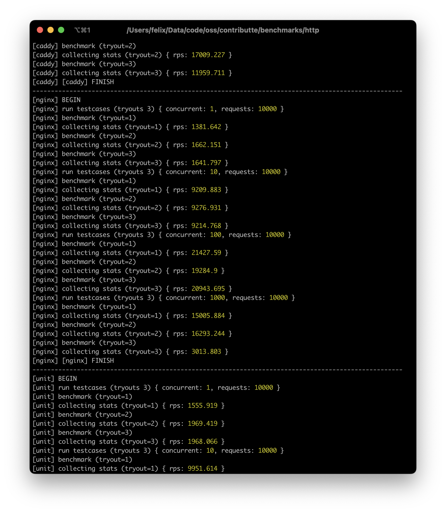
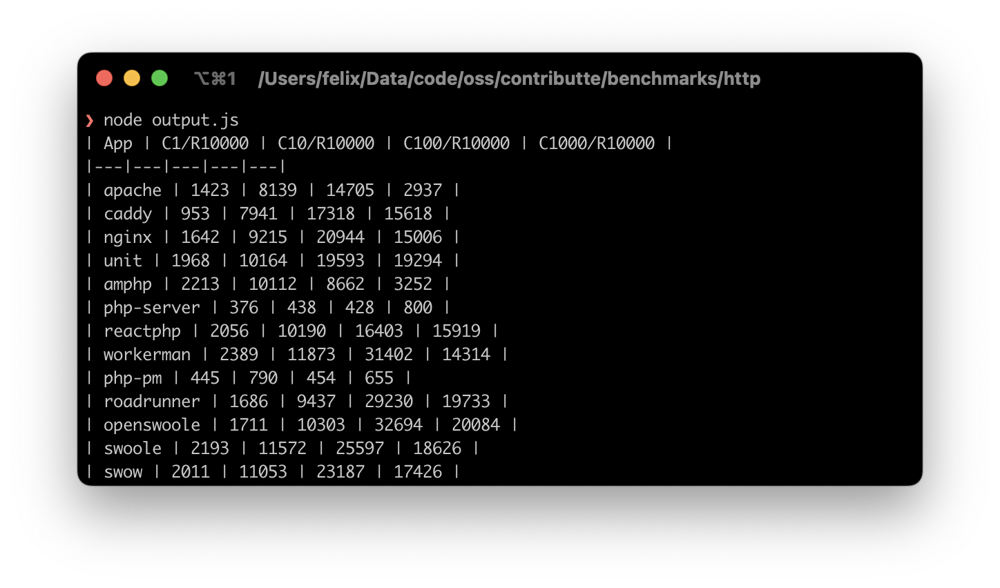

# HTTP BENCHMARK

Compare webservers, php frameworks, process managers and extensions.

## Prologue

All measurements are done in Docker container with PHP 8.2.

Here is a list of all tested solutions.

**Webservers**

- Apache
- Caddy
- Nginx
- Nginx Unit

**Frameworks**

- Amphp
- PHP server
- ReactPHP
- Workerman

**Process managers**

- PHP-PM
- Roadrunner

**Extensions**

- Swoole
- Openswoole
- Swow

## Requirements

- Docker
- Make
- Node.js
- Benchmark tools (hey, wrk or plow)

## Usage

**Preparing**

- Clone this project.
- Compile docker base images via `make build-bases`.
- Compile all docker images via `make build-all`.
- See all build docker images via `docker images`, e.q. `benchmark/http:roadrunner`.

**Preparing (OSX)**

- Setup `.env` with your setup.
  - `DOCKER_PLATFORM=linux/arm64`

**Benchmarking (manual)**

- Spin docker via `make run-[name]` e.q. `make run-nginx`, `make run/roadrunner`.
- Run benchmark using [hey](https://github.com/rakyll/hey) via `make test-hey`.
- Run benchmark using [wrk](https://github.com/wg/wrk) via `make test-wrk`.
- Run benchmark using [plow](https://github.com/six-ddc/plow) via `make test-plow`.

**Benchmarking (auto)**

- Measure benchmarks via [`node benchmark.js`](benchmark.js). It requires Node.js, Docker and [plow](https://github.com/six-ddc/plow).

## Results

Calculated using [`node output.js`](output.js). There are median RPS from all measurements by single app.

> Apple M1 Ultra / 128 GB.

| App | C1/R10000 | C10/R10000 | C100/R10000 | C1000/R10000 |
|---|---|---|---|---|
| apache | 1423 | 8139 | 14705 | 2937 |
| caddy | 953 | 7941 | 17318 | 15618 |
| nginx | 1642 | 9215 | 20944 | 15006 |
| unit | 1968 | 10164 | 19593 | 19294 |
| amphp | 2213 | 10112 | 8662 | 3252 |
| php-server | 376 | 438 | 428 | 800 |
| reactphp | 2056 | 10190 | 16403 | 15919 |
| workerman | 2389 | 11873 | 31402 | 14314 |
| php-pm | 445 | 790 | 454 | 655 |
| roadrunner | 1686 | 9437 | 29230 | 19733 |
| openswoole | 1711 | 10303 | 32694 | 20084 |
| swoole | 2193 | 11572 | 25597 | 18626 |
| swow | 2011 | 11053 | 23187 | 17426 |
